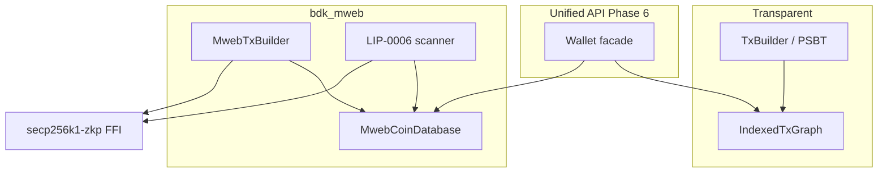

# MWEB architecture ADR (Phase 2+)

Status: **Accepted** (2026-07-26)  
Based on Gemini deep research post Phase 0–1; supersedes embedding Nexus/`lndltc` or gomobile-`mwebd` as the BDK library backend.

## Decision

Ship a native Rust crate **`bdk_mweb`** that:

1. Keeps confidential state in a future **`MwebCoinDatabase`** (never inside transparent `IndexedTxGraph`).
2. Uses **C-FFI** to consensus crypto (`libsecp256k1` MWEB modules / `secp256k1-zkp`), not pure-Rust Bulletproofs.
3. Performs LIP-0006-style scan locally (scan key stays on-device).
4. Preserves BDK’s **MIT OR Apache-2.0** license (no GPL `lndltc` / Nexus code).

Phase 0–1 transparent bridge filtering and Core-finalize peg-in remain valid until Phase 5.

## Rejected backends

| Approach | Why rejected for BDK-as-library |
| --- | --- |
| Nexus / `lndltc` | GPL-3.0; heavy NDK/CocoaPods; wrong product shape |
| Embedded `mwebd` (gomobile) | Go runtime bloat, GC/battery cost, nested FFI |
| Stuffing `mw_tx` into BIP174 PSBT | Breaks HW wallets; Core rejects MWEB in PSBT |
| Indexing HogAddr / v9 as UTXOs | Inflates transparent balance (Phase 0 forbids this) |

`mwebd` remains acceptable as an **external** server-side indexer, not an embedded dependency.

## Bifurcated wallet state



## Crypto FFI gate (Phase 4)

**Phase 2** uses the published [`secp256k1-zkp`](https://crates.io/crates/secp256k1-zkp) / `secp256k1-zkp-sys` (Elements) façade for Pedersen / rangeproof **smoke tests**.

Litecoin Core vendors MWEB-specific secp modules (`bulletproofs`, `commitment`, `aggsig`) under `src/secp256k1`. Before Phase 4 spend authoring, verify Elements proofs are accepted by `litecoind`. If not, vendor Core / Litecoin Foundation `libsecp256k1` into a thin `litecoin-secp256k1-zkp-sys` — still C-FFI, never reimplement Bulletproofs in Rust.

## Key derivation note (LIP vs Core)

[LIP-0004](https://github.com/litecoin-project/lips/blob/master/lip-0004.mediawiki) documents master paths `m/1/0/100'` (scan) and `m/1/0/101'` (spend).

**Litecoin Core 0.21** (`LoadMWEBKeychain`) actually derives:

- Scan: `m/0'/100'/0'`
- Spend: `m/0'/100'/1'`

Subaddress tweak (production `Keychain::GetSpendKey`):

```text
mi = BLAKE3( tag='A' || LE32(index) || scan_secret )
b_i = (b + mi) mod n
B_i = b_i·G
A_i = a·B_i
```

`bdk_mweb` defaults to **Core-compatible** paths so regtest addresses match `getnewaddress "" "mweb"`. LIP-0004 paths are available as an explicit alternate for experimenters.

## Peg-in / spend / peg-out (summary)

- **Peg-in:** MWEB body + `kernel_id` first; transparent v9 output; PSBT cannot carry `mw_tx` (attach after extract). See [`MWEB_PEGIN.md`](MWEB_PEGIN.md).
- **MWEB→MWEB:** entirely in `MwebTxBuilder` + FFI; no `IndexedTxGraph`.
- **Peg-out:** MWEB tx with peg-out kernel; miner HogEx; transparent indexer credits normal SPKs (Phase 0).

## Roadmap

| Phase | Goal | Acceptance |
| --- | --- | --- |
| **2** (this) | `bdk_mweb` + FFI façade + Core-compatible stealth addresses | Unit vectors + optional Core seed parity |
| **3** | `MwebCoinDatabase` + LIP-0006 scan/receive | Core→BDK MWEB receive on regtest |
| **4** | MWEB spend (`MwebTxBuilder`) | litecoind accepts BDK MWEB tx |
| **5** | Peg-in/out without Core key custody | Transparent↔MWEB round-trip |
| **6** | Unified balance / send API | E2E blended wallet flows |

## False paths

1. PSBT stuffing for `mw_tx`
2. Treating HogAddr / peg-in scripts as spendable UTXOs
3. Routing empty MWEB `script_pubkey()` through transparent `TxBuilder` as a normal payment
4. Embedding gomobile-`mwebd` in mobile BDK apps
5. Reimplementing Bulletproofs in pure Rust
