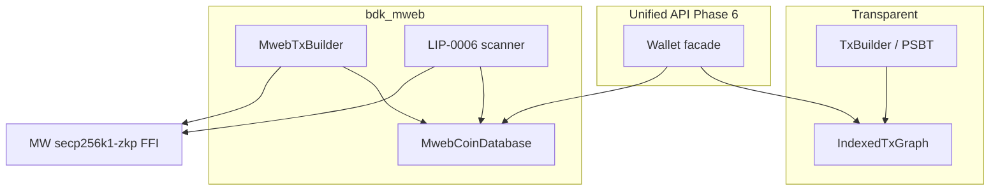

# MWEB architecture ADR (Phase 2+)

Status: **Accepted** (2026-07-26); Phase 5 peg-in/out (no Core MWEB key custody) landed.  
Based on Gemini deep research post Phase 0–1; supersedes embedding Nexus/`lndltc` or gomobile-`mwebd` as the BDK library backend.

## Decision

Ship a native Rust crate **`bdk_mweb`** that:

1. Keeps confidential state in **`MwebCoinDatabase`** (never inside transparent `IndexedTxGraph`).
2. Uses **C-FFI** to consensus crypto (`libsecp256k1` MWEB modules / `secp256k1-zkp`), not pure-Rust Bulletproofs.
3. Performs LIP-0006-style scan locally (scan key stays on-device).
4. Preserves BDK’s **MIT OR Apache-2.0** license (no GPL `lndltc` / Nexus code).

Phase 0–1 transparent bridge filtering remains. Core `sendtoaddress` finalize is still a supported
alternate for peg-in, but BDK can author peg-in/out bodies itself (Phase 5).

## Rejected backends

| Approach | Why rejected for BDK-as-library |
| --- | --- |
| Nexus / `lndltc` | GPL-3.0; heavy NDK/CocoaPods; wrong product shape |
| Embedded `mwebd` (gomobile) | Go runtime bloat, GC/battery cost, nested FFI |
| Stuffing `mw_tx` into BIP174 PSBT | Breaks HW wallets; Core rejects MWEB in PSBT |
| Indexing HogAddr / v9 as UTXOs | Inflates transparent balance (Phase 0 forbids this) |
| Elements CT `rangeproof_sign` for MWEB outputs | Wrong proof system (Borromean/CT, not 675-byte bulletproofs) |
| Pure-Rust Bulletproofs | Consensus risk; ADR requires C-FFI |

`mwebd` remains acceptable as an **external** server-side indexer, not an embedded dependency.

## Bifurcated wallet state



## Crypto FFI gate (Phase 4 — done)

**Rejected:** Elements [`secp256k1-zkp`](https://crates.io/crates/secp256k1-zkp) CT `RangeProof` / `rangeproof_sign` — not Litecoin’s fixed **675-byte** `secp256k1_bulletproof_rangeproof_prove` with `extraData = output message`.

**Chosen:** [`grin_secp256k1zkp`](https://crates.io/crates/grin_secp256k1zkp) (CC0) with `ENABLE_MODULE_BULLETPROOF` + schnorrsig/aggsig — same modules Core’s `Bulletproofs.cpp` / `Schnorr.cpp` use. Façade in `bdk_mweb::crypto`:

- `bulletproof_prove` / `bulletproof_verify` (675 bytes)
- `schnorr_sign` (`secp256k1_schnorrsig_sign`) / `schnorr_verify` (`aggsig_verify_single`)
- Pedersen commit + Core-compatible `BlindSwitch` (H generator prefix `0x0b`)

**Gate test:** Core peg-in `mw_tx` output proofs verify under the FFI (`tests/core_bulletproof_gate.rs`).

## Key derivation note (LIP vs Core)

[LIP-0004](https://github.com/litecoin-project/lips/blob/master/lip-0004.mediawiki) documents master paths `m/1/0/100'` (scan) and `m/1/0/101'` (spend).

**Litecoin Core 0.21** (`LoadMWEBKeychain`) actually derives:

- Scan: `m/0'/100'/0'`
- Spend: `m/0'/100'/1'`

Subaddress tweak (production `Keychain::GetSpendKey`):

```text
mi = BLAKE3( tag='A' || LE32(index) || scan_secret )
b_i = (b + mi) mod n
B_i = b_i·G
A_i = a·B_i
```

`bdk_mweb` defaults to **Core-compatible** paths so regtest addresses match `getnewaddress "" "mweb"`. LIP-0004 paths are available as an explicit alternate for experimenters.

## Peg-in / spend / peg-out (summary)

- **Peg-in:** `bdk_mweb::build_pegin` authors stealth outs + peg-in kernel (`kernel_id` = v9 program); wallet PSBT + `attach_mweb_tx`. See [`MWEB_PEGIN.md`](MWEB_PEGIN.md).
- **MWEB→MWEB:** `MwebTxBuilder` (Output/Input/Kernel::Create + offsets); empty vin/vout Litecoin tx with `mw_tx`; no `IndexedTxGraph`.
- **Peg-out:** `MwebTxBuilder::add_pegout` + peg-out kernel; miner HogEx pays watched transparent SPKs (Phase 0 filter still applies to HogAddr).

## Roadmap

| Phase | Goal | Acceptance |
| --- | --- | --- |
| **2** | `bdk_mweb` + FFI façade + Core-compatible stealth addresses | Unit vectors + Core seed parity |
| **3** | `MwebCoinDatabase` + Core `RewindOutput` receive scan | Core→BDK MWEB receive on regtest |
| **4** | MWEB spend (`MwebTxBuilder`) | litecoind accepts BDK MWEB→MWEB tx |
| **5** (this) | Peg-in/out without Core key custody | Transparent↔MWEB round-trip |
| **6** | Unified balance / send API | E2E blended wallet flows |

### Phase 3–5 notes

- Receive scan implements Litecoin Core `Keychain::RewindOutput` (LIP-0004 §7 as shipped), not a
  full LIP-0006 P2P client. Wire input today is decoded `mw_tx` bodies. LIP-0006 `getmwebutxos` /
  leafset sync remains the future light-client transport.
- Coins live in in-memory `MwebCoinDatabase` only — never in transparent `IndexedTxGraph`.
- Spend authors sorted inputs/outputs (Core `Transaction::Create`), change at address index `0`,
  fee (+ optional peg-in / peg-out) kernel with stealth excess.
- Phase 5: `kernel_id` = Core `Kernel::GetHash`; `build_pegin` / `add_pegout`; regtest round-trip
  without Core holding MWEB keys. Unified balance remains Phase 6.

## False paths

1. PSBT stuffing for `mw_tx`
2. Treating HogAddr / peg-in scripts as spendable UTXOs
3. Routing empty MWEB `script_pubkey()` through transparent `TxBuilder` as a normal payment
4. Embedding gomobile-`mwebd` in mobile BDK apps
5. Reimplementing Bulletproofs in pure Rust
6. Using Elements CT rangeproofs for MWEB output proofs
