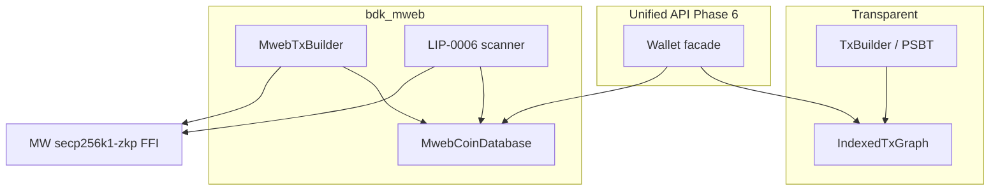

# MWEB architecture ADR (Phase 2+)

Status: **Accepted** (2026-07-26); Phase 6 facade + parallel MWEB coin persist landed.  
**Addendum (2026-07-27):** ltcsuite is the **reference** for PSBTv2 MWEB and light-client sync architecture (Losh). See [`LTCSUITE_ALIGNMENT.md`](LTCSUITE_ALIGNMENT.md).  
Based on Gemini deep research post Phase 0–1; supersedes embedding Nexus/`lndltc` or gomobile-`mwebd` as the BDK library backend.

## Decision

Ship a native Rust crate **`bdk_mweb`** that:

1. Keeps confidential state in **`MwebCoinDatabase`** (never inside transparent `IndexedTxGraph`).
2. Uses **C-FFI** to consensus crypto (`libsecp256k1` MWEB modules / `secp256k1-zkp`), not pure-Rust Bulletproofs.
3. Performs LIP-0006-style scan locally (scan key stays on-device).
4. Preserves BDK’s **MIT OR Apache-2.0** license (no GPL `lndltc` / Nexus code).
5. **Aligns library PSBT + sync with ltcsuite** (copy PSBTv2 MWEB key map from `ltcd/ltcutil/psbt`; shape continuous sync like `mwebsync`). Crypto and coin DB remain Rust.

Phase 0–1 transparent bridge filtering remains. Core `sendtoaddress` finalize is still a supported
alternate for peg-in, but BDK can author peg-in/out bodies itself (Phase 5).

### Interim vs reference (PSBT)

| Path | Role |
| --- | --- |
| **`fund_mweb_*` → `sign_funded_mweb` → scrub → `Psbt::extract_tx_with_mweb`** (`mw_tx` at extract; `attach_mweb_tx` / wallet `build_mweb_*` deprecated) | Happy-path CLI / facade (mainnet send + peg-out) |
| **Native `bitcoin::psbt::mweb` (`litecoin` 0.32.8-rc.2)** | Wire-interop shape; BDK thin helpers in `bdk_mweb::psbt` |

Do **not** invent a parallel proprietary key scheme. Do **not** embed Go.

## Rejected backends

| Approach | Why rejected for BDK-as-library |
| --- | --- |
| Nexus / `lndltc` | GPL-3.0; heavy NDK/CocoaPods; wrong product shape |
| Embedded `mwebd` (gomobile) | Go runtime bloat, GC/battery cost, nested FFI |
| Stuffing raw `mw_tx` into BIP174 as opaque proprietary blob | Wrong interop story; use **ltcsuite PSBTv2 MWEB typed keys** instead |
| Indexing HogAddr / v9 as UTXOs | Inflates transparent balance (Phase 0 forbids this) |
| Elements CT `rangeproof_sign` for MWEB outputs | Wrong proof system (Borromean/CT, not 675-byte bulletproofs) |
| Pure-Rust Bulletproofs | Consensus risk; ADR requires C-FFI |
| Go FFI to ltcd/mwebsync | License/ops shape; **port semantics**, don’t ship a Go runtime |

`mwebd` remains acceptable as an **external** server-side indexer, not an embedded dependency.
ltcsuite (`ltcd` / `ltcwallet` / `mwebsync`, ISC) is the **read-and-port** reference, not a linked dependency.

## Bifurcated wallet state



## Crypto FFI gate (Phase 4 — done)

**Rejected:** Elements [`secp256k1-zkp`](https://crates.io/crates/secp256k1-zkp) CT `RangeProof` / `rangeproof_sign` — not Litecoin’s fixed **675-byte** `secp256k1_bulletproof_rangeproof_prove` with `extraData = output message`.

**Chosen:** [`grin_secp256k1zkp`](https://crates.io/crates/grin_secp256k1zkp) (CC0) with `ENABLE_MODULE_BULLETPROOF` + schnorrsig/aggsig — same modules Core’s `Bulletproofs.cpp` / `Schnorr.cpp` use. Façade in `bdk_mweb::crypto`:

- `bulletproof_prove` / `bulletproof_verify` (675 bytes)
- `schnorr_sign` (`secp256k1_schnorrsig_sign`) / `schnorr_verify` (`aggsig_verify_single`)
- Pedersen commit + Core-compatible `BlindSwitch` (H generator prefix `0x0b`)

**Gate test:** Core peg-in `mw_tx` output proofs verify under the FFI (`tests/core_bulletproof_gate.rs`).

## Key derivation note (LIP vs Core)

[LIP-0004](https://github.com/litecoin-project/lips/blob/master/lip-0004.mediawiki) documents master paths `m/1/0/100'` (scan) and `m/1/0/101'` (spend).

**Litecoin Core 0.21** (`LoadMWEBKeychain`) actually derives:

- Scan: `m/0'/100'/0'`
- Spend: `m/0'/100'/1'`

Subaddress tweak (production `Keychain::GetSpendKey`):

```text
mi = BLAKE3( tag='A' || LE32(index) || scan_secret )
b_i = (b + mi) mod n
B_i = b_i·G
A_i = a·B_i
```

`bdk_mweb` defaults to **Core-compatible** paths so regtest addresses match `getnewaddress "" "mweb"`. LIP-0004 paths are available as an explicit alternate for experimenters.

## Peg-in / spend / peg-out (summary)

- **Peg-in:** `bdk_mweb::build_pegin` / wallet `prepare_mweb_pegin` → PSBT +
  `extract_pegin_with_mweb_psbt`. See [`MWEB_PEGIN.md`](MWEB_PEGIN.md).
- **MWEB→MWEB:** `Wallet::fund_mweb_send` → `sign_and_extract_funded_mweb` (native PSBT maps);
  empty vin/vout Litecoin tx with `mw_tx` at extract; no `IndexedTxGraph`.
- **Peg-out:** `Wallet::fund_mweb_pegout` → same fund/sign/extract path with peg-out kernel;
  miner HogEx pays watched transparent SPKs.
- **Balance:** `Wallet::balance_combined(&MwebCoinDatabase)` — caller still owns the MWEB DB.

## Roadmap

| Phase | Goal | Acceptance |
| --- | --- | --- |
| **2** | `bdk_mweb` + FFI façade + Core-compatible stealth addresses | Unit vectors + Core seed parity |
| **3** | `MwebCoinDatabase` + Core `RewindOutput` receive scan | Core→BDK MWEB receive on regtest |
| **4** | MWEB spend (`MwebTxBuilder`) | litecoind accepts BDK MWEB→MWEB tx |
| **5** | Peg-in/out without Core key custody | Transparent↔MWEB round-trip |
| **6** (this) | Unified balance / send API (minimal facade) | E2E blended wallet flows |

### Phase 3–6 notes

- Receive scan implements Litecoin Core `Keychain::RewindOutput` (LIP-0004 §7 as shipped).
  Wire input may be decoded `mw_tx` bodies or LIP-0006 FULL_UTXO batches via
  `bdk_mweb::lip0006` (feature `lip0006`: codecs, `sync_mweb_at_tip`, `TcpMwebPeer`)
  and mwebsync-shaped [`mweb_sync::MwebSyncer`](../crates/mweb/src/mweb_sync.rs)
  (differential leafset + tip-only / fine-window dating). PSBTv2 MWEB key maps live in
  [`psbt`](../crates/mweb/src/psbt.rs) until the `litecoin` crate ships native types.
  Default verify mode is `HeaderAndPmmr` (leafset_root + segment parent_hashes vs
  `output_root`); `VerifyMode::Trusted` remains for scripted/tests.
- Coins live in `MwebCoinDatabase` — never in transparent `IndexedTxGraph`.
- Spend authors sorted inputs/outputs (Core `Transaction::Create`), change at address index `0`,
  fee (+ optional peg-in / peg-out) kernel with stealth excess.
- Phase 5: `kernel_id` = Core `Kernel::GetHash`; `build_pegin` / `add_pegout`; regtest round-trip
  without Core holding MWEB keys.
- Phase 6: **minimal facade** — `CombinedBalance` (confirmed vs untrusted pending),
  `prepare_mweb_pegin` / `fund_mweb_send` / `fund_mweb_pegout` on `Wallet` (feature `mweb`).
  Legacy `build_mweb_*` deprecated. No automatic domain routing in transparent `build_tx`.
- **Parallel persist** (feature `persist` on `bdk_mweb`): serde/`Merge` `ChangeSet` staged on
  `MwebCoinDatabase`, appendable via `bdk_file_store::Store` or SQLite (`rusqlite` feature).
  Wallet [`MwebStore`] helpers load/persist beside the wallet. Not folded into
  `Wallet::ChangeSet`. Secrets are spend-equivalent — encrypt at rest with feature `encrypt`
  (`seal` / `seal_changeset`); apps own the key.
- LIP-0006 verified sync: `mwebheader` → `mwebleafset` → batched `mwebutxos` with
  PMMR checks (`bdk_mweb::pmmr`, feature `lip0006`). Tip seam is `(BlockHash, u32)` —
  Electrum stays outside the crate. Peg-in maturity = 6 (`MWEB_PEGIN_MATURITY`);
  reorgs call `MwebStore::disconnect_from(height)`. Prefer `MwebSyncer` for receive /
  confirmation dating; `sync_mweb_at_tip` remains as a one-shot helper.
- **ltcsuite parity:** native PSBTv2 MWEB in `litecoin` 0.32.8-rc.2 consumed; crates.io publish
  + full in-PSBT peg-in (no `build_pegin` sidecar) remain follow-ups. See
  [`LTCSUITE_ALIGNMENT.md`](LTCSUITE_ALIGNMENT.md) and [`MWEB_PEER_OPS.md`](MWEB_PEER_OPS.md).

## False paths

1. Opaque BIP174 proprietary `mw_tx` blobs (use ltcsuite PSBTv2 MWEB keys instead)
2. Treating HogAddr / peg-in scripts as spendable UTXOs
3. Routing empty MWEB `script_pubkey()` through transparent `TxBuilder` as a normal payment
4. Embedding gomobile-`mwebd` in mobile BDK apps
5. Reimplementing Bulletproofs in pure Rust
6. Using Elements CT rangeproofs for MWEB output proofs
7. Inventing a PSBT key map divergent from ltcsuite
