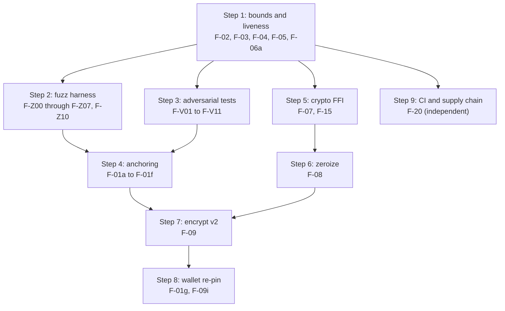

# `crates/mweb` Security Review and Hardening Plan

Scope: `crates/mweb` (`bdk_mweb`) in this fork, as consumed by `ltc-wallet-mac`
(pinned at `BDK_REF=7462cb4248c1766f1f6ba3e4517cf89c1065b42a` in that repo's
`deps/pins.env`).

Review date: 2026-08-01. Reviewed at ~9k LoC across `src/` and `tests/`.

## Contents

- [Threat model](#threat-model)
- [Findings summary](#findings-summary)
- [F-01: MWEB header is never anchored to the block](#f-01-mweb-header-is-never-anchored-to-the-block-critical)
- [Priority 1 — network-facing parsing](#priority-1--network-facing-parsing)
- [Priority 2 — `crypto.rs` FFI](#priority-2--cryptors-ffi)
- [Priority 3 — verification enforcement](#priority-3--verification-enforcement)
- [Priority 4 — key hygiene / zeroize](#priority-4--key-hygiene--zeroize)
- [Priority 5 — `encrypt.rs`](#priority-5--encryptrs)
- [Priority 6 — supply chain and CI](#priority-6--supply-chain-and-ci)
- [Fuzzing plan](#fuzzing-plan)
- [Public API compatibility matrix](#public-api-compatibility-matrix)
- [Suggested sequencing](#suggested-sequencing)

---

## Threat model

The attacker we care about is **a malicious or compromised LIP-0006 peer** that
the wallet connects to over plain TCP (`TcpMwebPeer`), plus a secondary
**attacker with read/write access to the wallet's data directory** (the reason
at-rest encryption exists at all).

Everything a peer sends is attacker-controlled: the `mwebheader`, `mwebleafset`,
and `mwebutxos` payloads, their length prefixes, and the P2P framing around
them. The crate currently treats several of these as semi-trusted.

Out of scope: consensus correctness of Litecoin itself, and the transparent BDK
crates.

---

## Findings summary

| ID | Severity | Area | Summary |
| --- | --- | --- | --- |
| F-01 | Critical | `p2p.rs`, `lip0006.rs`, `mweb_sync.rs` | MWEB header never bound to the block hash; `HeaderAndPmmr` verifies peer data against roots from the same peer |
| F-02 | High | `p2p.rs:199` | `MwebLeafset` decode allocates `vec![0u8; size]` from an unbounded `VarInt` |
| F-03 | High | `p2p.rs:118`, `p2p.rs:130` | `MwebUtxos` decode calls `Vec::with_capacity(n)` with unbounded `n` |
| F-04 | High | `lip0006_tcp.rs:322` | `recv` allocates a peer-supplied `u32` length before validating magic or checksum |
| F-05 | High | `lip0006.rs:162`, `mweb_sync.rs:1008` | Cursor never advances if a peer returns leaves below `start_index`: infinite loop plus unbounded memory growth |
| F-06 | High | `pmmr.rs:250`, `pmmr.rs:487` | Verification loops iterate `0..output_mmr_size` / `0..num_nodes` with a peer-controlled bound |
| F-07 | High | `crypto.rs:372` | `schnorr_sign` silently falls back to emitting the opaque signature struct when serialization fails |
| F-08 | Medium | crate-wide | No `zeroize`: scan/spend keys, blinding factors, and shared secrets are freely cloned and dropped in place |
| F-09 | Medium | `encrypt.rs` | No AAD, no version byte, no domain separation between blob types; enables cross-file swap and rollback |
| F-10 | Medium | `coin_db.rs:161`, `tx_builder.rs:119` | `.sum()` over `u64` amounts can overflow; `u64 as i64` casts on peg-in/peg-out amounts |
| F-11 | Medium | `pmmr.rs:20`, `pmmr.rs:91` | `leaf_position` multiply overflow and `Index::left_child`/`right_child` underflow on adversarial indices |
| F-12 | Medium | `pmmr.rs:224` | `verify_leafset` ignores `leafset.block_hash` |
| F-13 | Medium | `scan.rs`, `pmmr.rs` | Rangeproofs and output signatures are never verified on any sync path |
| F-14 | Medium | `p2p.rs:213` | `unspent_leaf_indices` amplifies a leafset blob 64x into a `Vec<u64>` |
| F-15 | Medium | `crypto.rs:229` | Hand-declared `extern "C"` schnorrsig ABI with no compile-time check; signing context never randomized |
| F-16 | Low | `lip0006.rs:148`, `mweb_sync.rs:887` | `expect` / indexing panics reachable on malformed-but-accepted input |
| F-17 | Low | `p2p.rs:226` | `MwebLeafset::from_indices` computes `(max / 8) + 1` with no bound |
| F-18 | Low | `mweb_sync.rs:216` | `is_banworthy_peer_error` matches on error message substrings; wording is load-bearing |
| F-19 | Low | `coin_db.rs`, `changeset.rs` | `PartialEq` derived over secret fields; no constant-time comparison anywhere |
| F-20 | Info | CI / deps | No fuzzing, no `cargo deny`, floating action tags, Dependabot does not cover Cargo |

---

## F-01: MWEB header is never anchored to the block (Critical)

This is the finding that reframes items 1 and 3 of the review request, so it is
written up before the numbered priorities.

`MwebHeaderMsg` decodes three fields:

```145:154:crates/mweb/src/p2p.rs
/// `mwebheader` message (BIP37 merkle block + HogEx + MWEB header).
#[derive(Clone, Debug, PartialEq, Eq)]
pub struct MwebHeaderMsg {
    /// BIP37 partial merkle tree for the block (includes the HogEx txid).
    pub merkle: MerkleBlock,
    /// HogEx (Hogwarts Express) bridge transaction.
    pub hogex: Transaction,
    /// MWEB extension-block header at this tip.
    pub mweb_header: MwebBlockHeader,
}
```

`merkle` and `hogex` are decoded and then **never read again** anywhere in the
crate. Grepping for `extract_matches`, `merkle`, or `hogex` outside `p2p.rs`
returns only test fixtures. The only consumer of the message is `mweb_header`:

```749:765:crates/mweb/src/mweb_sync.rs
        let header_msg = if matches!(self.verify, VerifyMode::HeaderAndPmmr) {
            Some(source.get_header(tip_hash)?)
        } else {
            None
        };
        let mweb_header = header_msg.as_ref().map(|h| h.mweb_header.clone());
        ...
        if let Some(ref hdr) = mweb_header {
            verify_leafset(&leafset, &hdr.leafset_root, hdr.output_mmr_size)?;
        }
```

So `VerifyMode::HeaderAndPmmr` checks the peer's leafset against a
`leafset_root` the same peer chose, and each UTXO batch against an
`output_root` the same peer chose. A malicious peer supplies a self-consistent
fabricated MWEB state and every check passes. The three roots in
`MwebBlockHeader` have no relationship to the requested `block_hash`, to the
block's proof of work, or to anything the wallet independently knows.

**Impact.** A single malicious peer can present an arbitrary UTXO set: hide
real coins (understated balance, coins silently treated as spent by the
`state.leafset.is_empty()` sweep at `mweb_sync.rs:1048`), or inject fabricated
outputs. Injected outputs cannot lie about their value — `rewind_output`
recomputes `switch_commit(pre_blind, value)` and compares it to the commitment
(`scan.rs:164`) — but the attacker can still choose any value it likes when
constructing the output, producing phantom spendable balance and, via F-10,
overflowing balance arithmetic.

**Interaction with the wallet's cross-check.** `cross_check_leafset` in
`ltc-wallet-mac` (`crates/wallet-core/src/mweb.rs:227`) does provide real
defense here: it asks up to two *other* peers for a header and re-runs
`verify_leafset`. But it is advisory (sets a warning, does not roll back the
sync), it reports "cross-check unavailable" rather than failing when no second
peer is reachable, and it only covers the leafset root — not `output_root`. It
raises the bar to peer collusion or eclipse; it does not close the gap.

**Fix (agreed approach: new opt-in mode first).**

- [x] **F-01a** Add `pub fn header_hash(h: &MwebBlockHeader) -> [u8; 32]` to
      `p2p.rs`, computed as `blake3_hash(&serialize(h))` (Core
      `mw::Header::GetHash`). `MwebBlockHeader` has no hash method in
      rust-litecoin, so this lives here. Add a known-answer test against a
      mainnet header captured from litecoind.
- [x] **F-01b** Add `MwebHeaderMsg::verify_anchored(&self, block_hash: BlockHash)
      -> Result<(), Error>` implementing, in order:
      1. `self.merkle.header.block_hash() == block_hash`;
      2. `self.merkle.extract_matches(&mut txids, &mut indexes)` succeeds and
         its returned merkle root equals `self.merkle.header.merkle_root`;
      3. `self.hogex.compute_txid()` is in `txids`, and its index is the last
         position in the block (HogEx is always the final transaction — see
         `block_carries_mweb` in rust-litecoin `blockdata/block.rs:344`);
      4. the HogEx output that carries the MWEB header commitment equals
         `header_hash(&self.mweb_header)`.
      Step 4 needs the exact opcode/output confirmed against Litecoin Core
      before coding — the peg-in kernel uses witness v9 (`0x59`, see the
      assertion at `tx_builder.rs:657`), and HogEx is expected to use v8
      (`0x58`), but **verify this against Core's HogEx validation rather than
      assuming it**.
- [x] **F-01c** Add `VerifyMode::Anchored` as a new variant. Keep
      `#[default] HeaderAndPmmr` unchanged so the wallet's behavior does not
      move. `Anchored` runs `verify_anchored` and then everything
      `HeaderAndPmmr` already does.
- [x] **F-01d** Note in the `VerifyMode::HeaderAndPmmr` doc comment that it is
      *self-consistency* verification, not chain-anchored verification, and
      that callers must pair it with an independent cross-check.
- [x] **F-01e** Regtest test: `Anchored` accepts a real litecoind `mwebheader`,
      and rejects each of four mutations (wrong block hash, tampered
      `output_root`, tampered `leafset_root`, HogEx swapped for another tx).
- [x] **F-01f** Mainnet probe (ignored test, like
      `probe_mweb_tx_getdata_notfound` at `lip0006_tcp.rs:396`) confirming a
      live litecoind's `mwebheader` carries a merkle proof sufficient for
      `verify_anchored`. **This is the gate for flipping the default.**
- [x] **F-01g** Once F-01f passes, flip `#[default]` to `Anchored` in a separate
      commit and re-pin the wallet. `ScriptedMwebSource` and
      `tests/lip0006_sync.rs:26-40` build a placeholder `MerkleBlock` with a
      zero merkle root, so they must either move to `Trusted` or gain real
      proofs at that point.

---

## Priority 1 — network-facing parsing

### F-02 / F-03: unbounded allocation from length prefixes

```196:207:crates/mweb/src/p2p.rs
impl Decodable for MwebLeafset {
    fn consensus_decode<R: Read + ?Sized>(r: &mut R) -> Result<Self, encode::Error> {
        let block_hash = BlockHash::consensus_decode(r)?;
        let size = VarInt::consensus_decode(r)?.0 as usize;
        let mut leafset = vec![0u8; size];
        r.read_exact(&mut leafset)?;
```

`size` is an unbounded `VarInt`. Ten bytes of attacker input request a
terabyte-scale allocation; `read_exact` never gets a chance to fail first.
Allocation failure calls `handle_alloc_error`, which **aborts** — it is not a
catchable panic. `MwebUtxos::consensus_decode` has the same shape twice, with
`Vec::with_capacity(n)` at `p2p.rs:118` and `p2p.rs:130`.

- [x] **F-02a** Add a `limits` module (new file `src/limits.rs`) with named
      constants and a short rationale comment for each:
      `MAX_P2P_PAYLOAD` (Core's `MAX_PROTOCOL_MESSAGE_LENGTH`; confirm the
      litecoind value), `MAX_LEAFSET_BYTES`, `MAX_UTXOS_PER_BATCH` (65535 —
      `num_requested` is `u16`, so a peer can never legitimately exceed it),
      `MAX_PARENT_HASHES`, `MAX_OUTPUT_MMR_SIZE`.
- [x] **F-02b** In `MwebLeafset::consensus_decode`, reject `size >
      MAX_LEAFSET_BYTES` before allocating.
- [x] **F-03a** In `MwebUtxos::consensus_decode`, reject `n > MAX_UTXOS_PER_BATCH`
      and `nh > MAX_PARENT_HASHES` before allocating. Replace both
      `Vec::with_capacity(n)` calls with `Vec::new()` plus
      `reserve(n.min(CAP))`, so a length prefix that passes the cap check still
      cannot preallocate more than the peer actually delivers.
- [x] **F-02c** Assert `MAX_LEAFSET_BYTES` comfortably exceeds the real mainnet
      leafset (roughly `output_mmr_size / 8`) in a test, so the cap cannot
      silently break live sync as the chain grows.
- [x] **F-03b** Move the `output_format != OUTPUT_FORMAT_FULL` check
      (`p2p.rs:121`, currently *inside* the entry loop) to before the loop, so a
      zero-entry non-FULL message is rejected too.

### F-04: P2P frame length not bounded or authenticated before allocation

```317:333:crates/mweb/src/lip0006_tcp.rs
    fn recv(&mut self) -> Result<RawNetworkMessage, Error> {
        let mut header = [0u8; 24];
        self.stream.read_exact(&mut header)...;
        let len = u32::from_le_bytes(header[16..20].try_into().unwrap()) as usize;
        let mut payload = vec![0u8; len];
```

Up to 4 GiB allocated per message, with no magic check and no checksum check
first (`deserialize` validates both, but only after the buffer exists). A peer
that sends 24 bytes of garbage can exhaust wallet memory.

- [x] **F-04a** Validate `header[0..4]` against `self.magic` before allocating,
      and reject `len > MAX_P2P_PAYLOAD`. Both failures should produce errors
      whose text is matched by `is_banworthy_peer_error` (see F-18).
- [x] **F-04b** Refactor the framing into a pure
      `fn parse_frame(magic: Magic, header: &[u8; 24], payload: &[u8]) ->
      Result<RawNetworkMessage, Error>` so it is unit-testable and fuzzable
      without a socket.
- [x] **F-04c** Bound total bytes read per logical request. `recv_until_cmd`
      caps at 64 messages (`lip0006_tcp.rs:336`) but each may be
      `MAX_P2P_PAYLOAD`, and each `recv` can block for the full 180 s read
      timeout — a peer can legitimately stall a single call for hours. Add a
      wall-clock deadline in addition to the message count.

### F-05: infinite loop and unbounded memory when a peer replays low leaves

```160:164:crates/mweb/src/lip0006.rs
        result.downloaded = result.downloaded.saturating_add(batch.utxos.len());
        let last_leaf = batch.utxos.last().map(|e| e.leaf_index).unwrap_or(start);
        while i < indices.len() && indices[i] <= last_leaf {
            i += 1;
        }
```

If a peer returns a non-empty batch whose highest `leaf_index` is *below*
`indices[i]`, the inner `while` advances nothing, the outer loop re-issues the
identical request forever, and `entries` grows without bound on every pass.
The empty-batch case is handled; this one is not. `mweb_sync.rs:1008` has the
same defect. A peer can trigger it by replaying an earlier, genuinely valid
batch — so it survives `verify_utxo_batch` even in `HeaderAndPmmr` mode.

- [x] **F-05a** In both loops, reject any batch where
      `batch.utxos.first().leaf_index < req.start_index`, or where
      `last_leaf < indices[i]`, as a protocol violation.
- [x] **F-05b** Add a belt-and-braces guarantee that `i` strictly increases
      every iteration (or the loop errors out), so no future edit can
      reintroduce a non-advancing path.
- [x] **F-05c** Cap accumulated `entries` in `sync_mweb_utxos` — it currently
      holds every downloaded output in memory for the whole sync
      (`lip0006.rs:130`), unlike `run_once` which scans per batch. Either
      stream it the same way or bound it.
- [x] **F-05d** Regression test with a scripted source that replays a
      low-index batch: sync must return an error, not hang. Give it an
      explicit timeout so a regression fails CI rather than wedging it.

### F-06: verification loops sized by peer-controlled `output_mmr_size`

```250:256:crates/mweb/src/pmmr.rs
fn calc_pruned_parents(unspent: &[u8], num_leaves: u64) -> BTreeSet<u64> {
    let mut ret: BTreeSet<u64> = BTreeSet::new();
    for i in 0..num_leaves {
        if !bitset_test(unspent, i) {
            ret.insert(leaf_position(i));
        }
    }
```

```489:503:crates/mweb/src/pmmr.rs
    let mut changed = true;
    while changed {
        changed = false;
        for pos in 0..num_nodes {
```

`num_leaves` is `header.output_mmr_size`, straight off the wire. `verify_leafset`
requires the leafset blob to be at least `num_leaves / 8` bytes, which bounds
this somewhat — but F-02 means the blob length is itself unbounded, and even at
honest mainnet sizes the fixed-point loop is `O(num_nodes)` per iteration and
runs once per batch. This is both a DoS vector and a likely real performance
problem on mainnet sync.

- [x] **F-06a** Reject `header.output_mmr_size > MAX_OUTPUT_MMR_SIZE` at the top
      of `verify_leafset` and `verify_utxo_batch`, before any loop.
- [x] **F-06b** Replace the `while changed { for pos in 0..num_nodes }`
      fixed-point search with a bottom-up walk over only the positions reachable
      from the known leaves and proof hashes. This is a correctness-preserving
      rewrite; keep the existing `core_assemble_segment_hash_indices_and_root`
      and `multi_mountain_*` tests green as the oracle.
- [x] **F-06c** Benchmark `verify_utxo_batch` at mainnet `output_mmr_size` before
      and after, and record both numbers here.
      *Measured after the linear-pass rewrite* (M-series macOS, `--release`, via
      `measure_verify_utxo_batch_cost` in `tests/pmmr_adversarial.rs`): 38 ms at
      35k leaves, 428 ms at 350k leaves (observed mainnet scale) — linear in
      chain size as designed. The pre-fix quadratic loop was never benchmarked
      because it was replaced before this measurement landed; the linearity of
      the two data points is the property the fix was for.

### F-11 / F-17: integer overflow on adversarial indices

- [x] **F-11a** `leaf_position` computes `2 * leaf_index - popcount` — panics in
      debug for `leaf_index > u64::MAX / 2`. Make it return `Option<u64>` or
      saturate, and audit all call sites. `verify_utxo_batch` happens to guard
      it via the `bitset_test` check at `pmmr.rs:407`, but `leaf_hashes_for_outputs`
      (public) and `MemMmr::add_output_id` do not.
- [x] **F-11b** `Index::left_child`/`right_child` subtract without checking
      (`pmmr.rs:91-103`). Use `checked_sub` and surface a verification error.
- [x] **F-11c** `MemMmr::hash_at` indexes `self.hashes[position as usize]`
      directly (`pmmr.rs:163`). Return `Result`.
- [x] **F-17a** Bound `MwebLeafset::from_indices` (`p2p.rs:226`) — it is public
      API and allocates `(max_index / 8) + 1` bytes.

### F-14: leafset index amplification

- [x] **F-14a** `unspent_leaf_indices` turns each set bit into a `u64`, a 64x
      blowup. Add `unspent_leaf_indices_bounded(max: usize)`, or switch the sync
      paths to iterate bits lazily. `sync_mweb_utxos:124` and `run_once` both
      materialize the full vector.

### F-16: reachable panics

- [x] **F-16a** Replace `mweb_header.as_ref().expect("header fetched")`
      (`lip0006.rs:148`, `mweb_sync.rs:887`, `mweb_sync.rs:960`) with an error
      return. The invariant holds today but is enforced only by matching on
      `VerifyMode` in two places.
- [x] **F-16b** Replace `.expect("parent has right child")`
      (`pmmr.rs:155`) and the `first().unwrap()` / `last().unwrap()` pair
      (`pmmr.rs:457-458`) with error returns.
- [x] **F-16c** Add `#![deny(clippy::unwrap_used, clippy::expect_used,
      clippy::indexing_slicing, clippy::arithmetic_side_effects)]` scoped to the
      wire-facing modules (`p2p`, `lip0006`, `lip0006_tcp`, `pmmr`), with
      `#[allow]` on the test modules.
      *Landed as `deny(clippy::unwrap_used, clippy::expect_used)`* on all five
      wire-facing modules (including `mweb_sync`). `indexing_slicing` and
      `arithmetic_side_effects` were deliberately not denied: the panic class
      they guard is covered by the fuzz targets plus `overflow-checks = true`
      in the fuzz profile, and blanket-denying them buries real findings under
      hundreds of mechanical `#[allow]`s on already-bounds-checked code.

---

## Priority 2 — `crypto.rs` FFI

### F-07: `schnorr_sign` serialize fallback (High)

```370:378:crates/mweb/src/crypto.rs
        let mut out = [0u8; 64];
        let ser_ok = unsafe { secp256k1_schnorrsig_serialize(ctx, out.as_mut_ptr(), &opaque) };
        if ser_ok != 1 {
            // Opaque layout matches wire form in this zkp fork.
            out = opaque;
        }
        Ok(out)
```

This assumes the opaque `secp256k1_schnorrsig` struct is byte-identical to the
wire encoding. That happens to hold for this vendored fork today, but the
assumption is unverified, silent, and load-bearing: this function signs every
MWEB output, input, and kernel. If it ever diverges, the wallet emits invalid
signatures — and because the fallback is silent, the first symptom is
unexplained rejected broadcasts.

- [x] **F-07a** Delete the fallback. Return
      `Error::Crypto("schnorrsig_serialize failed")` when `ser_ok != 1`.
- [x] **F-07b** Add a test asserting that for a fixed key and message, the
      serialized output equals the opaque bytes — i.e. pin the assumption as a
      test rather than a silent runtime branch. If it ever stops holding, CI
      says so.

### F-15: unchecked FFI ABI and unrandomized signing context

```215:245:crates/mweb/src/crypto.rs
    fn sign_ctx() -> *mut ffi::Context {
        static CTX: OnceBox<usize> = OnceBox::new();
        ...
    extern "C" {
        fn secp256k1_schnorrsig_sign(
            ctx: *const ffi::Context,
            sig: *mut [u8; 64],
            nonce_is_negated: *mut core::ffi::c_int,
            ...
```

Two issues. The `extern "C"` block is hand-transcribed against a vendored C
library with no header cross-check — an ABI mismatch is undefined behavior, not
a compile error. And `sign_ctx` builds a raw context that is never passed to
`secp256k1_context_randomize`, so signing has no side-channel blinding (the
Grin `Secp256k1` wrapper used elsewhere is a separate context).

- [x] **F-15a** Call `secp256k1_context_randomize` with 32 fresh random bytes
      immediately after `secp256k1_context_create` in `sign_ctx`, and re-check
      the return code.
- [x] **F-15b** Add a known-answer test for `schnorr_sign` against a vector
      produced by Litecoin Core / ltcd, so an ABI or semantic drift in the
      vendored library is caught. `ltcd_output_signature_matches_sender`
      (`scan.rs:456`) already does this for one output — promote the pattern to
      cover kernels and inputs.
- [x] **F-15c** Add a `const _: () = assert!(...)` (or a test) pinning
      `RangeProof`'s proof array length to 675. The `bullet-proof-sizing`
      feature (`Cargo.toml:20`) is what makes `crypto.rs:340` correct; if it is
      ever dropped the failure should be loud.
- [x] **F-15d** Buffer-size audit sweep: confirm every `copy_from_slice` in the
      `mw` module is provably length-matched. `pedersen_commit:281`
      (`out[0..33]` from `commit.0`) and `bulletproof_prove:330`
      (`proof.proof[..675]` after an explicit `plen` check) look correct;
      document why rather than leaving it implicit.
- [x] **F-15e** `bulletproof_prove` constructs a fresh
      `bitcoin::secp256k1::Secp256k1::new()` twice per proof
      (`crypto.rs:306`, `crypto.rs:311`). That is a ~100 ms cost per output for
      no benefit. Hoist to a `OnceBox`.

### F-19: constant-time secret comparison

No `subtle` dependency and no constant-time comparison anywhere. The concrete
exposures are modest — the compared values are mostly public (commitments,
roots, view tags) — but `MwebCoin` derives `PartialEq` over `blind`,
`shared_secret`, and `spend_key` (`coin_db.rs:38`), and `ChangeSet` inherits it.

- [x] **F-19a** Add `subtle`. Implement `PartialEq` for `MwebCoin` manually
      using `ConstantTimeEq` for the three secret fields, keeping the derived
      semantics otherwise (the wallet's `assert_eq!(opened, cs)` in its
      changeset roundtrip test must still pass).
      *Landed without the `subtle` dependency*: `secret::ct_eq32` /
      `ct_eq32_opt` implement the same volatile-read + accumulated-XOR barrier
      `subtle` uses, and `MwebCoin::eq` routes its three secret fields through
      them. The trade-off (one comparison at one width does not justify a new
      supply-chain node) is documented on `ct_eq32` itself.
- [x] **F-19b** Audit and document the remaining comparisons as
      public-data-only, so a future reader does not have to re-derive it.
      *Audit result*: outside `Secret32` / `MwebCoin`, every equality in the
      crate compares wire-public data — commitments, PMMR roots and hashes,
      block hashes, view tags, public keys (including `rewind_output`'s
      `expected_commit != output.commitment` and `expected_ke != ke` checks,
      whose left-hand sides are secret-derived but whose right-hand sides the
      peer already knows, and which run locally during scan where no
      remote-observable timing channel exists). The only secret-vs-secret
      equality paths are `Secret32::eq` and `MwebCoin::eq`, both constant-time.

---

## Priority 3 — verification enforcement

### F-13: rangeproofs and signatures are never verified during sync

`bulletproof_verify` and `schnorr_verify` are called only from
`crypto.rs` unit tests and `tests/core_bulletproof_gate.rs`. No sync path
verifies an output's rangeproof or its sender signature.

This is defensible in principle: a light client that has PMMR inclusion under a
PoW-anchored `output_root` inherits consensus validation, and `output_id`
(`scan.rs:97`) hashes both the rangeproof and the signature, so inclusion binds
them. **But that argument depends entirely on F-01**, which is not yet true —
and it does not hold at all in `VerifyMode::Trusted`.

Mitigating: `rewind_output` independently recomputes the commitment from the
unmasked value (`scan.rs:164-167`), so a forged output cannot misreport its
value without breaking that check.

- [x] **F-13a** Document the trust argument explicitly in the `pmmr` and `scan`
      module docs: inclusion-under-anchored-root is what substitutes for
      rangeproof verification, and it is void in `Trusted` mode.
- [x] **F-13b** Add an opt-in `MwebSyncer::verify_rangeproofs: bool` (default
      `false`) that runs `bulletproof_verify` over each *owned* output found by
      `scan_utxo_entries_at`. Restricting it to owned outputs keeps the cost
      proportional to wallet size rather than chain size.
- [x] **F-13c** Measure the per-proof verification cost and record it here, so
      the default can be revisited with data.
      *Measured*: ~1.3 ms per proof (M-series macOS, `--release`, via
      `measure_bulletproof_verify_cost` in `crypto.rs`). At that cost, verifying
      every *owned* output is negligible for any real wallet (1000 coins ≈
      1.3 s, once); verifying every *chain* output at mainnet scale (~350k)
      would be ~8 minutes, which is why `verify_rangeproofs` is scoped to owned
      outputs and off by default under `Anchored`.

### Adversarial tests for `verify_leafset` and PMMR roots

Existing coverage (`pmmr.rs:615-798`) is entirely happy-path plus one flipped
byte in `verify_leafset_blake3`. Every mutation below must produce `Err`:

- [x] **F-V01** `verify_leafset`: leafset one byte shorter than
      `output_mmr_size.div_ceil(8)`.
- [x] **F-V02** `verify_leafset`: trailing *non-zero* padding beyond `need`.
      Currently tolerated silently (`pmmr.rs:234` hashes only `..need`) — decide
      whether that is intended and test the decision either way.
- [x] **F-V03** `verify_leafset`: `output_mmr_size = 0`, and
      `output_mmr_size = u64::MAX` (must error, not hang — see F-06a).
- [x] **F-V04** `verify_leafset`: `leafset.block_hash` disagrees with the header's
      block. Requires F-12 first.
- [x] **F-V05** `verify_utxo_batch`: each `parent_hashes` entry flipped one bit
      at a time.
- [x] **F-V06** `verify_utxo_batch`: `parent_hashes` truncated by one, extended
      by one, and reordered.
- [x] **F-V07** `verify_utxo_batch`: a leaf's `output_id` mutated (via a mutated
      `range_proof`, exercising the `output_id` binding).
- [x] **F-V08** `verify_utxo_batch`: `leaf_index` values duplicated, reordered
      descending, and set beyond `output_mmr_size`.
- [x] **F-V09** `verify_utxo_batch`: an entry whose leaf bit is clear in the
      leafset (guard at `pmmr.rs:407`) — pin it with a test.
- [x] **F-V10** `verify_utxo_batch` fast path: confirm the `complete_unspent`
      shortcut at `pmmr.rs:417` cannot be induced by a peer to skip segment
      verification. It falls through on root mismatch, so it looks safe — prove
      it with a test that forces the fast path with wrong data.
- [x] **F-V11** The batch-shrink retry loop (`mweb_sync.rs:964-982`) halves
      `req_size` on `output_root mismatch`. Confirm a peer cannot use repeated
      induced failures to walk the client down to `req_size = 1` and then
      succeed with data that would have failed at full width.

### F-12: `verify_leafset` ignores the block hash

`MwebLeafset.block_hash` is accepted and never compared. Callers compensate
(`lip0006.rs:116`, `mweb_sync.rs:760`), and the wallet's cross-check relies on
the caller's `tip_hash` — but the function's own contract is weaker than it
looks.

- [x] **F-12a** Add `verify_leafset_at(leafset, block_hash, root, mmr_size)`
      that also checks `leafset.block_hash == block_hash`. Keep `verify_leafset`
      as-is (the wallet calls it directly at `mweb.rs:259`) and document the
      distinction.

### F-10: amount overflow

- [x] **F-10a** `MwebCoinDatabase::balance` (`coin_db.rs:161`) uses `.sum()` over
      `u64` — panics in debug, wraps in release. Use `saturating_add`, matching
      `balance_at` which already does.
- [x] **F-10b** `MwebTxBuilder::finish` (`tx_builder.rs:119-121`) sums input,
      recipient, and peg-out totals the same way. Use checked arithmetic and
      return `Error::InsufficientFunds` (or a new message) on overflow.
- [x] **F-10c** Validate `amount <= i64::MAX` before the `as i64` casts at
      `tx_builder.rs:188` (peg-in) and `tx_builder.rs:319` (peg-out). Also note
      that `write_mweb_varint` (`tx_builder.rs:509`) silently produces a
      one-byte encoding for negative input, which would be a consensus mismatch.
- [x] **F-10d** Reject rewound outputs with implausible values in
      `rewind_output` — an output claiming more than the 84 M LTC supply cannot
      be real, and rejecting it removes the overflow precondition at the source.

---

## Priority 4 — key hygiene / zeroize

Confirmed: `zeroize` appears nowhere in the crate — only transitively in
`Cargo.lock` via `chacha20poly1305` and `grin_secp256k1zkp`.

Secrets currently living in freely-copied plain memory:

- `MasterKeys { scan, spend }` (`keys.rs:77`) — derives `Clone`, no `Drop`.
- `MwebCoin { blind, shared_secret, spend_key }` (`coin_db.rs:40`) — derives
  `Clone` and is cloned on every `db.insert` (`coin_db.rs:134`, `:136`) and
  every `scan_utxo_entries_at` hit (`scan.rs:242-243`).
- `crypto::random_secret`'s loop-local `bytes` (`crypto.rs:159`), and every
  `[u8; 32]` returned by `blind_switch`, `secret_add`, `secret_sub`,
  `secret_mul`, `blind_sum`.
- `tx_builder`'s `kernel_offset`, `stealth_blind`, `ephemeral`, `sig_key`,
  `raw_blind`, and the `out_blinds` / `in_blinds` vectors
  (`tx_builder.rs:287-342`).
- **The JSON plaintext in `open_changeset`** (`encrypt.rs:72-73`) — a `Vec<u8>`
  containing every spend key in the wallet, in the clear, dropped without
  wiping. `serde_json`'s internal buffers too.

- [x] **F-08a** Add `zeroize = { version = "1", features = ["derive"] }` (already
      in the lock file at 1.9.0, so no new supply-chain surface).
- [x] **F-08b** Introduce `pub struct Secret32([u8; 32])` with `ZeroizeOnDrop`,
      constant-time `PartialEq`, and a `Debug` impl that prints `Secret32(..)`.
      Use it internally in `tx_builder` and `crypto` first, where it is not
      part of the public API.
- [x] **F-08c** `impl Drop for MasterKeys` zeroizing `scan` and `spend`.
      `bitcoin::secp256k1::SecretKey` does not zeroize itself; use
      `Zeroize` on the underlying bytes via `non_secure_erase()` if available in
      the pinned version, otherwise a manual volatile wipe.
- [x] **F-08d** `impl ZeroizeOnDrop for MwebCoin` covering `blind`,
      `shared_secret`, `spend_key`. **This is the highest-churn item** —
      `MwebCoin` is `Clone` and cloned on nearly every DB operation, so each
      clone becomes a separate wipe-on-drop. Verify no measurable sync
      regression.
- [x] **F-08e** Zeroize the decrypted plaintext in `encrypt::open` and
      `open_changeset` before it drops, and the serialized plaintext in
      `seal_changeset` (`encrypt.rs:64`).
      *Note*: the changeset wrappers (`seal_changeset*`, `open_changeset*`,
      `changeset_from_json`) wipe their plaintext buffers on success and error
      paths. Raw `open` returns the plaintext by move with no intermediate
      copy, so there is nothing internal left to wipe; its doc now states that
      the returned buffer is the caller's to zeroize.
- [x] **F-08f** Zeroize `random_secret`'s rejected candidates
      (`crypto.rs:158-163`).
- [x] **F-08g** Confirm `MwebCoin`'s `Debug` derive cannot leak secrets into the
      wallet's logs. It currently prints `blind`, `shared_secret`, and
      `spend_key` in full. Replace with a manual `Debug`. The doc comment at
      `coin_db.rs:34` says "never log them" — make that structural instead of
      advisory.
- [x] **F-08h** Document the limits honestly: Rust moves, `Vec` reallocation,
      and swap all defeat best-effort zeroization. This reduces the window; it
      does not eliminate it.

---

## Priority 5 — `encrypt.rs`

Agreed approach: **versioned envelope with transparent legacy read.**

Current state (`encrypt.rs:22-47`): `nonce (12B) || ChaCha20-Poly1305(ct||tag)`,
random nonce per seal, **no AAD**, no version byte, no domain separation.

**Nonce uniqueness.** A random 96-bit nonce gives a birthday collision around
2^48 seals under one key. The wallet reseals on every persist, so it will never
approach that — this is acceptable, but only by argument, not by construction.

**Tamper behavior.** Correct: Poly1305 rejects any modification, and
`open` returns an error rather than partial plaintext. Untested, though — there
is a `wrong_key_fails` test but no bit-flip, truncation, or nonce-mutation test.

**AAD — the real gap.** The wallet seals four distinct blobs under one key:
`mweb_coins.enc`, `mweb_sync.enc`, `mweb_index.enc`, `mweb_history.enc`
(`ltc-wallet-mac/crates/wallet-core/src/mweb.rs:108-122`). With no AAD and no
type tag, all four are interchangeable ciphertexts to `open`. An attacker with
write access to the wallet directory can **swap one file's contents for
another's**, or **roll back `mweb_coins.enc` to an older copy**, and every
authentication check still passes. Given that at-rest encryption exists
precisely because we assume disk access, this is the finding to fix.

- [x] **F-09a** Define the v2 envelope: `b"MWEBSEAL"` magic, `u8` version = 2,
      `u8` context tag, 12-byte nonce, ciphertext+tag. Bind magic, version, and
      context tag as the AEAD AAD so they cannot be edited.
- [x] **F-09b** Add `pub enum SealContext { Coins, SyncState, Index, History,
      Other(u8) }` and `seal_with_context` / `open_with_context`. Opening with
      the wrong context must fail — that is what kills the cross-file swap.
- [x] **F-09c** Keep `seal`/`open`/`seal_changeset`/`open_changeset` with
      today's exact signatures. `open` detects the magic: v2 envelope if
      present, legacy `nonce || ct` otherwise. Existing wallet files keep
      opening with no migration step. **No public API break.**
- [x] **F-09d** `seal` keeps writing the legacy format until the wallet opts in
      via `seal_with_context`; otherwise old and new binaries cannot share a
      wallet directory during rollout.
- [x] **F-09e** Add a monotonic `u64` counter field to the coins envelope for
      rollback detection, and have `open_with_context` optionally take a minimum
      expected counter. The wallet stores the high-water mark alongside its
      Argon2 blob. (Rollback cannot be solved inside `bdk_mweb` alone — this
      provides the mechanism; the wallet must supply the trusted counter.)
- [x] **F-09f** Tests: bit-flip in ciphertext, in tag, in nonce, in magic, in
      version, in context tag; truncation at every boundary; empty plaintext;
      wrong-context open; legacy blob opens; v2 blob rejected by a
      legacy-only reader. Each must error, never panic.
- [x] **F-09g** Test that two seals of identical plaintext produce different
      nonces (catches a future refactor to a fixed or counter nonce).
- [x] **F-09h** Document the 2^48 birthday bound and the reasoning for staying
      on ChaCha20-Poly1305 rather than XChaCha20, so the choice is deliberate
      and revisitable.
- [ ] **F-09i** Coordinate with `ltc-wallet-mac`: adopt `SealContext` per file,
      wire the rollback counter, re-pin. Track as a wallet-side task.

---

## Priority 6 — supply chain and CI

**Correction to the review brief: CI does cover `crates/mweb`.** There is a
dedicated `build-mweb` job (`.github/workflows/cont_integration.yml:124-149`)
building default / no-default / `persist` / `--all-features` and running
`cargo test --all-features`, plus workspace-wide MSRV, clippy, docs, fmt, and
`cargo llvm-cov --all` coverage. The `just _test-mweb` recipe
(`justfile:55-56`) runs `cargo test -p bdk_mweb --all-features`.

The real gaps are supply-chain posture and the fact that the litecoind-backed
tests silently no-op in CI.

**`grin_secp256k1zkp` provenance.** `0.7.15` from crates.io, checksum
`bf7bb95f...` (`Cargo.lock:1152-1165`). Not vendored, not patched. It is the
Grin project's fork of `secp256k1-zkp`, carrying the bulletproof and aggsig
modules Litecoin Core's `Bulletproofs.cpp` / `Schnorr.cpp` use. This is the
single most security-critical dependency in the crate and it is a
low-download-count crate with an independent C submodule.

- [x] **F-20a** Record `grin_secp256k1zkp` provenance in this document:
      upstream repo, which C commit the vendored `secp256k1-zkp` corresponds to,
      whether it matches what Litecoin Core ships, and when it was last
      updated. This is the answer we want to have already written down the day
      an advisory lands.
- [x] **F-20b** Decide vendoring. `vendor/` already holds a `bitcoincore-rpc`
      fork, so the pattern exists. Vendoring pins the C code against a yanked
      or re-published crate and makes the diff against Core auditable; it also
      means owning the update. Recommend vendoring given it is consensus crypto.
- [x] **F-20c** Add `deny.toml` mirroring `ltc-wallet-mac/deny.toml`:
      `unknown-registry = "deny"`, `unknown-git = "deny"`,
      `allow-git = [IndigoNakamoto/rust-litecoin]` (the workspace `[patch]` at
      `Cargo.toml:31-32` pins it to commit `0b328533...`), `yanked = "deny"`,
      and the same license allowlist.
- [x] **F-20d** Add a `supply-chain` CI job running
      `cargo deny check advisories bans licenses sources`, on PR/push and on a
      weekly schedule, matching the wallet's `ci.yml:154-160`.
- [x] **F-20e** Extend `.github/dependabot.yml` (currently GitHub Actions only)
      with a `cargo` ecosystem entry.
- [x] **F-20f** Pin all GitHub Actions to full commit SHAs. Currently only three
      of eleven are pinned (`codecov-action`, `create-pull-request`,
      `rust-cache`); `actions/checkout@v6`,
      `actions-rust-lang/setup-rust-toolchain@v1`,
      `actions-rust-lang/audit@v1`, `actions/upload-artifact@v7`,
      `dtolnay/rust-toolchain@stable`, `actions/create-github-app-token@v3`,
      `crazy-max/ghaction-import-gpg@v6`, and
      `github/codeql-action/upload-sarif@v4` float. This also requires relaxing
      the `ref-pin` policies in `.github/zizmor.yml:3-9` that currently permit
      tag pinning.
- [x] **F-20g** Review the four ignored advisories in `.cargo/audit.toml:1-9`
      (`RUSTSEC-2026-0098`, `-0099`, `-0104`, `RUSTSEC-2025-0141`). Record why
      each is ignored and whether it touches the mweb dependency graph;
      undocumented ignores decay into permanent blind spots.
- [x] **F-20h** Add a `regtest-mweb` CI job that sets `LITECOIND_EXE` and
      actually runs `core_bulletproof_gate`, `core_spend`,
      `core_pegin_pegout_roundtrip`, and `lip0006_sync`. Today these compile in
      CI and then return early — `try_node_from_env()` yields `None`
      (`tests/core_bulletproof_gate.rs:17-19`), so the crypto gate has never
      actually run on CI.
- [x] **F-20i** Add `crates/mweb` to `.github/CODEOWNERS` (no entry today).
- [x] **F-20j** Add a `cargo +nightly miri` job over the pure-Rust PMMR and
      codec tests, excluding the FFI paths. Miri would have caught the
      arithmetic overflow class in F-11 directly.

---

## Fuzzing plan

*(Original state: no fuzzing existed in this repo.)* The harness now lives in
`crates/mweb/fuzz/` — see its README for running it, the seed corpus, and the
crash-reproduction flow. `rust-litecoin` already had a honggfuzz harness
(`fuzz/fuzz_targets/litecoin/`, `fuzz/fuzz.sh`, `fuzz/generate-files.sh`), and
mirroring that structure keeps tooling consistent across the two forks.

- [x] **F-Z00** Create `crates/mweb/fuzz/` with honggfuzz, modeled on
      `rust-litecoin/fuzz/`. Add a `just fuzz` recipe and a CI job running each
      target for a bounded time on a schedule (not per-PR).

Targets, in priority order:

- [x] **F-Z01** `mweb_leafset_decode` — `MwebLeafset::consensus_decode` on
      arbitrary bytes. Directly targets F-02. Must not allocate unboundedly;
      run under a memory limit so a regression fails rather than OOMs the host.
- [x] **F-Z02** `mweb_utxos_decode` — `MwebUtxos::consensus_decode`. Targets
      F-03.
- [x] **F-Z03** `mweb_header_msg_decode` — `MwebHeaderMsg::consensus_decode`,
      which transitively fuzzes `MerkleBlock` and `Transaction` decoding as
      reached from this crate's framing.
- [x] **F-Z04** `p2p_frame` — the `parse_frame` helper from F-04b, over
      arbitrary 24-byte headers plus payloads.
- [x] **F-Z05** `verify_leafset` — structured input (arbitrary leafset bytes,
      root, `output_mmr_size`). Property: returns in bounded time and never
      panics. Targets F-06 and F-11.
- [x] **F-Z06** `verify_utxo_batch` — the highest-value target. Structured
      input: arbitrary header roots, `output_mmr_size`, leafset, leaf indices,
      and `parent_hashes`. Properties: never panics, never hangs, and **never
      returns `Ok` for a batch whose leaf hashes were mutated**.
- [x] **F-Z07** `pmmr_index_math` — `leaf_position`, `Index::at`, `sibling`,
      `left_child`, `right_child` over arbitrary `u64`. Cheap, and directly
      targets F-11.
- [x] **F-Z08** `rewind_output` — arbitrary `mweb::Output` bytes against a fixed
      keyset. Must never panic and must never return a coin for a
      non-matching output.
- [x] **F-Z09** `sealed_open` — `encrypt::open` on arbitrary bytes with a fixed
      key. Must never panic. Extend to the v2 envelope after F-09a.
- [x] **F-Z10** `sync_driver` — a scripted `MwebUtxoSource` returning
      fuzzer-chosen batches, driving `sync_mweb_utxos` under a wall-clock
      budget. This is the target that catches F-05-class liveness bugs; the
      others only catch memory-safety and panics.

Seed corpora: capture real mainnet `mwebheader`, `mwebleafset`, and `mwebutxos`
payloads from litecoind and check them in under `fuzz/corpus/`.
*Done, with a variation*: seeds are checked in under
`crates/mweb/fuzz/hfuzz_input/<target>/input/` (the layout `fuzz.sh` feeds to
honggfuzz) and are regenerated deterministically by the harness's `gen_corpus`
bin (`just fuzz-corpus`). The `Output` payloads are real ltcd-generated regtest
encodings from `tests/fixtures/`; the message wrappers use the wallet's own
encoders. The scheduled fuzz workflow fails if the checked-in corpus drifts
from the generator.

---

## Public API compatibility matrix

The wallet must be updated and re-pinned for anything marked "breaks".

| Item | Wallet use | This plan |
| --- | --- | --- |
| `ChangeSet` | `mweb.rs:60`, `:767`, sqlite migration | Unchanged. F-08d adds `Drop` to `MwebCoin`; F-19a hand-writes `PartialEq` preserving semantics |
| `MwebLeafset` | `mweb.rs:243-246` | Fields unchanged; decode gains bounds (F-02b) |
| `verify_leafset` | `mweb.rs:259-263` | Signature unchanged; gains an `output_mmr_size` ceiling (F-06a). New `verify_leafset_at` is additive |
| `TcpMwebPeer` | `mweb.rs:253`, `:990`, `discovery.rs:222` | `connect` / `get_header` / `broadcast_tx` unchanged; internal framing hardened |
| `seal` / `open` | `mweb.rs:727`, `:733` | Signatures unchanged; `open` reads both formats (F-09c) |
| `seal_changeset` / `open_changeset` | `mweb.rs:108`, `:772` | Signatures unchanged |
| `encrypt-changeset` feature | enabled in wallet | Unchanged |
| `VerifyMode` | not called directly | New `Anchored` variant is additive. **Flipping the default (F-01g) changes sync behavior** — re-pin required |
| `MwebSyncer::tip_only()` | `mweb.rs:298` | Gains `verify_rangeproofs: bool` (default `false`), constructed via `..Default::default()` so no break |
| `Error` | display only | F-18 added `Error::Peer(BanReason, String)` (the wallet only displays errors, so no exhaustive match broke; verified by compiling the wallet against the change). New peer-attributable errors must use the `Error::bad_proof` / `protocol` / `transport` constructors |
| `MwebCoin` | struct literal in wallet tests | F-08d/F-08g change `Drop` and `Debug`, not fields. Literal construction still compiles |
| `leafset_has_leaf` | `mweb.rs:475` | Unchanged |
| `MWEB_PEGIN_MATURITY`, `CHANGE_ADDRESS_INDEX` | `mweb.rs:399`, `:1037` | Unchanged |

- [x] **F-API1** F-18: `is_banworthy_peer_error` (`mweb_sync.rs:216`) classifies
      peers by matching substrings in error text. Every new error message added
      by this plan must be checked against that list — a new bounds-check error
      that does not contain a matching substring will fail to rotate away from a
      malicious peer. Add a test asserting each new message classifies
      correctly, and file a follow-up to replace string matching with a typed
      discriminant.
      *Superseded by the typed discriminant itself*: classification is now
      `Error::Peer(BanReason, _)` via `Error::ban_reason()`, so no message
      wording is load-bearing. `banworthy_classification_is_typed` and
      `crate_constructed_peer_errors_classify_banworthy` in `mweb_sync.rs`
      pin the behavior.

---

## Suggested sequencing



Rationale: the bounds and liveness fixes are self-contained, break nothing, and
remove the crash-and-hang class first. The fuzz harness lands next so every
subsequent change is exercised against it. Anchoring depends on the mainnet
probe (F-01f), so it should not block the earlier work. The wallet re-pin
happens once, at the end, carrying both the `VerifyMode` default flip and the
`SealContext` adoption.

**Definition of done for each step:** `just pre-push` green (fmt, workspace
`--all-features` check, clippy `-D warnings`, `cargo test -p bdk_mweb
--all-features`), plus the litecoind-backed suites run locally with
`LITECOIND_EXE` set — they no-op without it, so a green CI run alone does not
demonstrate the crypto paths still work.
